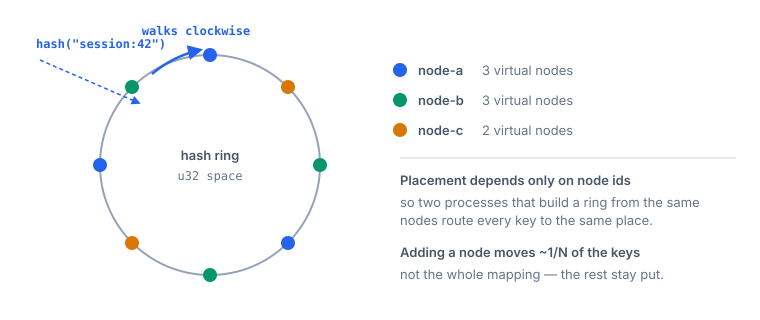
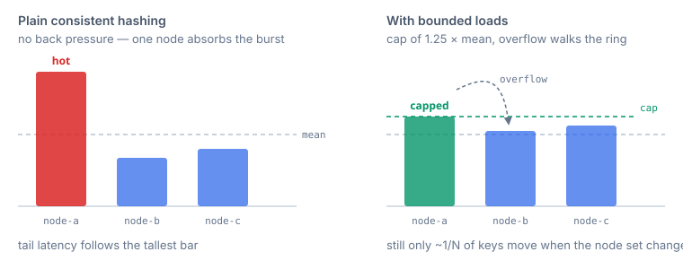
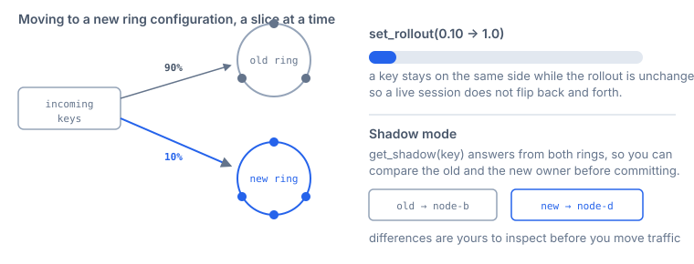

<h1 align="center">shardring</h1>

<p align="center">
  Consistent hashing in Rust with <strong>bounded loads</strong>, <strong>live migration between ring configurations</strong>, and a compact in-memory layout.
</p>

<p align="center">
  <a href="https://github.com/cleitonaugusto/shardring/actions/workflows/ci.yml"></a>
  
  
  
</p>

---

## What it does

Given a set of nodes and a key, it decides **which node owns that key** — and keeps that decision stable while nodes come and go.

<p align="center">
  
</p>

```rust
use shardring::{CompactRing, DefaultHash, Node};

let ring = CompactRing::<DefaultHash>::builder()
    .add_nodes(vec![
        Node::new("node-a", 100),
        Node::new("node-b", 100),
        Node::new("node-c", 200), // twice the share
    ])
    .build()?;

let owner = ring.get(b"session:42")?;
let replicas = ring.get_n(b"session:42", 3)?;
```

## Why another one

Most crates give you a ring and a `get()`. The parts that hurt in practice are the ones around it.

### A burst lands on one node

Plain consistent hashing has no back pressure, so an uneven ring or a hot key overloads a single node — and tail latency follows the tallest bar. `BoundedRing` implements *Consistent Hashing with Bounded Loads* (Mirrokni, Thorup, Zadimoghaddam, 2016): a per-node cap of `(1+ε)·mean`, overflowing to the next node on the ring.

<p align="center">
  
</p>

```rust
let bounded = BoundedRing::builder(ring).max_load_factor(1.25).build()?;

let node = bounded.get(b"key")?.id.clone();
bounded.acquire(&node);  // count the in-flight work
bounded.release(&node);  // when it finishes
```

### Changing the ring reshuffles everything at once

`DualRing` runs the old and the new configuration side by side, moves a share of keys you choose, and can answer from both at once so you compare before committing.

<p align="center">
  
</p>

```rust
let mut dual = DualRing::builder(old_ring, new_ring)
    .strategy(MigrationStrategy::HashBased)
    .rollout_percentage(0.10)
    .build()?;

let (old_owner, new_owner) = dual.get_shadow(b"key")?; // compare, don't switch
dual.set_rollout(0.50);                                // then move more
```

### Every process has to agree

Placement derives only from node ids, so two processes that build a ring from the same nodes route every key to the same node. A test builds two rings independently and compares 10,000 keys.

## Choosing an algorithm

```mermaid
flowchart TD
    A[Do buckets have stable names<br/>and come and go?] -->|No, fixed 0..n| J[jump_consistent_hash<br/>O(1), no allocation]
    A -->|Yes| B[Do you need protection<br/>against a hot node?]
    B -->|Yes| C[BoundedRing<br/>cap + overflow]
    B -->|No| D[Is lookup throughput<br/>more important than memory?]
    D -->|Yes| E[MaglevTable<br/>flat table, fixed size]
    D -->|No| F[CompactRing<br/>weighted virtual nodes]
```

| Module | What it does |
|---|---|
| `ring` | `CompactRing`: weighted virtual nodes, 6 bytes per point (`u32` hash + `u16` node index) |
| `bounded` | `BoundedRing`: per-node cap with overflow |
| `migration` | `DualRing`: hash-based, percentage and datacenter rollout, plus shadow mode |
| `maglev` | `MaglevTable`: Google's Maglev |
| `jump` | `jump_consistent_hash`: O(1), minimal memory, fixed bucket count |
| `adaptive` | Virtual node count derived from a target coefficient of variation |
| `health` | `HealthAwareRing`: skips unhealthy nodes (Tokio) |

## Install

```toml
[dependencies]
shardring = "0.1"
```

Optional features: `migration`, `serialization`, `health`, `serde`. Builds for `wasm32-unknown-unknown`, so the same placement logic runs in a browser or an edge runtime.

## Status

**0.1, API unstable.** Tested with unit, property-based and fuzz targets; not yet run in production.

No performance or memory numbers are published here on purpose — earlier drafts carried figures that turned out to come from a bug in how virtual nodes were counted. They will come back when they come from a reproducible benchmark on a known machine.

What is measured today, by tests:

- rings built independently from the same nodes agree on 10,000 keys
- distribution stays under a 0.15 coefficient of variation for 10, 50 and 200 nodes
- adding one node to a ring of ten moves under 20% of the keys
- snapshots reject a wrong version, a truncated buffer and out-of-range node indices

## What this is not

- **Not a datastore.** It decides where something belongs; moving or replicating data is yours.
- **Not a cluster.** No membership, gossip or consensus here.
- **Not `no_std`.** The crate uses `alloc` types throughout.

## Development

```bash
cargo test --workspace --all-features
cargo clippy --workspace --all-targets --all-features -- -D warnings
cargo bench -p shardring-bench
cd shardring/fuzz && cargo +nightly fuzz run fuzz_ring
```

Full crate documentation: [`shardring/README.md`](shardring/README.md).

## License

MIT OR Apache-2.0, at your option.
